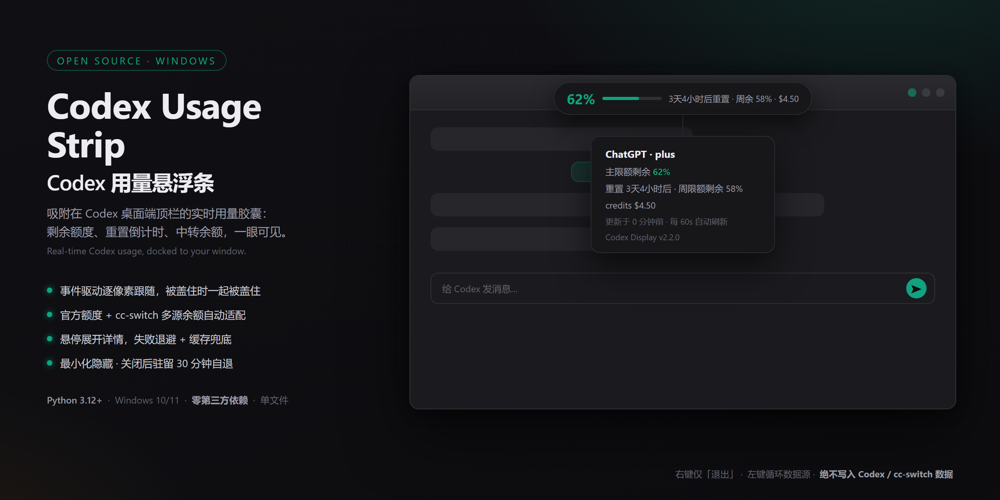

# Codex 用量悬浮条



    [](LICENSE)

实时显示 Codex 用量的小胶囊悬浮条，吸附在 Codex 桌面端窗口顶栏水平居中处，窗口移动/缩放时逐像素自动跟随（WinEvent 事件驱动）；Z 序紧贴 Codex 窗口正上方（非全局置顶），被其他窗口盖住时一起被盖住，最小化/关闭时自动隐藏。深色圆角胶囊外观（Win11 DWM 圆角），不抢焦点、不进 Alt-Tab。

启动（二选一，均纯手动、零常驻）：Win 键搜 "codex" 回车（开始菜单快捷方式「Codex 用量悬浮条」），或双击 `启动用量悬浮条.bat`。单实例锁防重复。退出：右键悬浮条 → 退出；**最小化或把 Codex 移到其他虚拟桌面只是隐藏浮条，会一直等待窗口恢复、不计时；只有窗口真正关闭才启动 30 分钟驻留**，超时自动退出。

## 使用

- **左键点击**：循环切换数据源（当前激活 provider → cc-switch 里的各中转 → OpenAI 官方，有则显示）
- **悬停**：展开详情面板（余额/限额构成、重置倒计时、**输出速率、输入缓存命中率、当前模型**、更新时间等）
- **右键**：仅「退出」
- 自动每 60 秒刷新（与 Codex CLI 同频）；按剩余量显示：剩余 >30% 绿色、≤30% 橙色、≤10% 红色；最近一次模型响应在 10 分钟内时，胶囊次行追加 `tok/s` 速率段

## 模型实时指标（本地解析，参考社区用量监控器的做法）

`codex_metrics.py` 解析 `~/.codex/sessions/` 最新会话日志（rollout JSONL，Codex 桌面端与 CLI 共写）里的 token 统计事件：

- **输出速率**：按「上一次工具输出/用户消息 → 本次响应 token_count」的时间差，配对最近一次响应的输出 token 数（含思考时间，即实际等待的口径）
- **输入缓存命中率**：会话累计 `cached_input_tokens / input_tokens`
- 多文件择新：跳过「旧会话被打开但无新响应」的文件，选真正有最新响应的那个；只读 token 数/时间戳/模型名，不碰对话内容，纯本地零网络

## 可靠性设计（参考社区用量监控器/悬浮窗项目的成熟做法）

- **失败退避**：连续拉取失败时刷新间隔自动翻倍（60s→120s→…封顶 600s），成功即复位，不会对故障端点高频重试
- **陈旧缓存**：拉取失败但已有历史数据时，保留上次数值（变灰并标注「缓存 X 分钟前」），悬停可见错误详情；完全没有数据时才显示红字错误
- **隐藏时停拉**：Codex 窗口消失期间跳过网络请求，窗口回来且数据过期才补拉
- **崩溃日志**：pythonw 无 stderr，未捕获异常会写入 `crash.log`（带时间戳，超 128KB 自动截断）

## 配置（overlay.toml）

浮条目录下的 `overlay.toml` 可调六个参数（删除该文件即回默认，越界值自动夹回安全范围），改后重启浮条生效：

```toml
refresh_seconds = 60        # 用量刷新间隔，秒（15~600）
gone_exit_minutes = 30      # Codex 窗口消失后驻留时长，分钟（1~240）
hover_delay_ms = 350        # 悬停展开详情的延迟，毫秒（100~2000）
poll_docked_ms = 800        # 停靠时的窗口校验轮询，毫秒（200~5000）
poll_idle_ms = 2000         # 无 Codex 窗口时的空闲轮询，毫秒（500~10000）
max_backoff_seconds = 600   # 连续拉取失败时的最大退避间隔，秒（60~3600）
```

## 数据源（自动适配）

数据层 `usage_sources.py` 每次取数重新读取 `~/.codex/config.toml` 判断当前激活的提供商：

- 默认（ChatGPT 登录）→ 官方 `chatgpt.com/backend-api/codex/usage`，显示主限额剩余百分比 + 重置倒计时（付费计划附「周余」和 credits）；
- 配置了自定义 `model_provider` → 走中转余额协议：one-api 通用 → 自定义 `/v1/usage`（SAIL 式）→ DeepSeek `/user/balance` 自动回退；
- 激活 provider 指向本地代理等不提供余额接口的地址时，自动按 provider 名到 cc-switch 库里找同名条目，用它持有的真实计费地址取余额（只读，不写 CCS）；
- 另可显示 cc-switch 库里带 key 的任意中转（左键切换），官方源仅在 `~/.codex/auth.json` 存在时进入循环。

cc-switch 切换 provider 后 60 秒内激活视图自动跟随（读的是每次取数时最新的 config.toml）。

## 与 Codex 同生共死（可选，当前未启用）

`mcp_usage_server.py` 支持进程级联动：在 `~/.codex/config.toml` 注册 `[mcp_servers.codex_usage]` 后，Codex 启动会拉起 server 并自动启动悬浮条（`--parent-pid`，严格同生共死），对话里还能文字查询用量。但 cc-switch 切换 provider 时会抹掉该注册段，需重新追加——因此当前保持纯手动 bat 启动。

## 微调

其余少量常量（吸附窗口识别 `TARGET_EXE` / `TARGET_PATH_MARKER`：进程名 + MSIX 安装路径双重校验，避免误吸到 ZCode 等窗口；进度条宽度 `BAR_W` 等）在 `codex_usage_overlay.py` 顶部。

## 文件

- `codex_usage_overlay.py` — 悬浮条主程序（零第三方依赖，tkinter + ctypes）
- `usage_sources.py` — 数据层：官方 / one-api / SAIL 式 / DeepSeek 自动识别与取数
- `codex_metrics.py` — 模型实时指标：本地解析 Codex 会话日志的输出速率与缓存命中率
- `mcp_usage_server.py` — MCP server：生命周期联动 + 文字查询工具（当前未注册，备用）
- `启动用量悬浮条.bat` — 手动启动
- `codex-usage.exe`（位于 Python312 目录）— `pythonw.exe` 的改名副本，任务管理器里显示为 `codex-usage`；升级 Python 后需重新复制

## 许可

[MIT](LICENSE) — 可自由使用、修改与分发。
